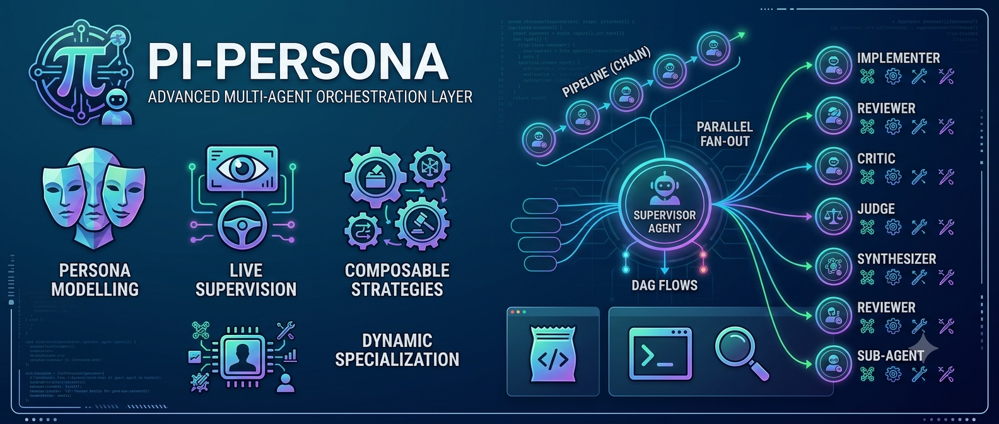

<p align="center">
  
</p>

A multi-agent orchestration layer for the [Pi](https://github.com/earendil-works/pi) coding agent.
It turns one agent into a **supervisor** that runs specialized sub-agents — synchronously or in the
background, one at a time or fanned out in parallel — coordinates them with composable strategies
(vote, judge, critic-loop, map, synthesize, DAG flows), and lets you watch, steer, stop, and message
them mid-run. Sub-agents specialize *dynamically* (skills + an on-the-fly role + model + tools), so
new behavior needs no new files.

A **persona** is the top layer: a switchable *modus operandi* — from "delegate opportunistically" to
a mandatory deliberating council. Everything under it is data (Markdown + `teams.yaml` + small
strategy files), so you reshape the whole system without touching the core.

> **Bundled personas are opt-in.** A fresh install ships none — run `/persona seed` (or
> `/persona restore`) once to install the defaults into `~/.pi/agent/`, then edit them or add your
> own. Project (`.pi/`) overrides user overrides builtin, so your copy always wins.

## What it does

- **Sub-agents, sync or async** — delegate one or fan out many, each an isolated run with its own
  model, skills, tools, and optional git-worktree isolation. Block for the result, or run
  `async: true` in the background and collect later with `/peek` or `intercom wait`.
- **Live supervision** — peek progress, steer a run mid-flight, hard-stop it; a `coaching` persona
  adds a two-way bus where a child asks you a blocking `decision` and you reply. All under hard
  limits (timeout, token budget, concurrency, max children) with cooperative abort.
- **Composable strategies** — orchestration is small files over a Strategy SDK: fan-out, pipeline,
  map, critic-loop, vote (`magi`), multi-round council, judge, synthesize, debate, pair, compete.
  Adding one is a new file, not a core change.
- **Dynamic specialization** — a generic `operator` becomes a specialist from the skills it loads
  plus an on-the-fly `role` (extra system prompt at delegation time). A roster can specialize one
  agent into several perspectives inline (`{ agent, role, model }`).
- **Flows** — a declarative DAG over strategies (`*.flow.json`): phases wired by `needs`, fanning
  out where independent, journaled so an interrupted flow resumes; `gate: true` pauses for approval.
- **Live view** — one agent tree sticks above the input. `f9` (or `/agents`) opens an overlay: ↑↓
  move, ⏎ read an agent's full chronological log, `x` stop, `s` steer.

## Concepts

| Thing | Is | Lives in |
|---|---|---|
| **Persona** | a switchable supervisor identity + way of working | `personas/*.md` |
| **Agent** | a sub-agent the supervisor runs (prompt + model + tools) | `agents/*.md` |
| **Team** | a named roster of agents | `teams.yaml` |
| **Strategy** | how a roster is orchestrated (vote, loop, rounds…) | `src/orchestration/strategies/*.ts` |
| **Contract** | the structured shape a sub-agent returns (so votes tally) | `contracts/*.contract.json` |

## How it works

- **Two engines, one seam.** Sub-agents run in-process by default (a `createAgentSession` per
  agent — fast, and steerable: you can inject a message into a running sub-agent). Set
  `PI_PERSONA_ENGINE=child` to spawn each as an isolated `pi --mode json -p` process instead. Either
  way pi-persona never re-spawns supervisors (no fork bombs), the same hard limits apply, and each
  run's output `contract@hash` is pinned so a hot reload can't change a run mid-flight.
- **Everything is data.** Personas and agents are Markdown + YAML frontmatter; teams are a
  `teams.yaml`; strategies are small TypeScript files registered by name. A persona's capabilities
  (which tools, which delegate targets) resolve once and are enforced on every call.
- **Decide, then do.** A council persona consults its ensemble through the `council` tool, gets a
  ruling (winner + tally + recorded dissent), then executes it with its own tools and re-convenes
  when execution raises a new decision — state → decision → execution.
- **Model-aware.** A loose `model` name ("sonnet") resolves to your own session provider's id (not a
  look-alike you're not logged into); an ensemble runs its cores on *different* models for diverse
  blind spots. `/models [query]` searches the installed models.

## Bundled personas, agents & teams

Installed by `/persona seed` (see the [opt-in note](#pi-persona) above). Switch persona with `f8`.

**Personas** — the supervisor you become:

| Persona | What it's for |
|---|---|
| `elite` | Security player-coach — lead operator for pentest / red-team / lab-CTF; loads the right technique skill per engagement phase, owns tunnels/pivots/shells, delegates heavy/parallel/long work. |
| `dev` | Software engineer **and** reviewer — tests-first flow, loads the right coding skills, reviews its own/others' changes with cited `file:line` evidence, delegates large/parallel work. |
| `researcher` | Deep-research supervisor — fans one deep-dive agent out per sub-question, follows links recursively, consolidates sourced findings into a `.research/<topic>/` folder. |
| `planner` | Planning-first orchestrator — decomposes goals into bounded, verifiable steps and writes plan/design/architecture docs; never edits code, hands implementation to `dev` and investigation to `researcher`. |
| `magi` | MAGI triarchy — three deliberately-biased cores vote → ruling + tally + recorded dissent, with one anonymised **reflection** round so a core can catch a blind spot without groupthink. |
| `audit` | Parallel audit council — one `reviewer` runs three lens-focused passes (security · performance · tests), then a `reviewer` **merges** them into one de-duplicated verdict (`synthesize`). |
| `judge` | The three MAGI cores each argue a distinct complete position; an impartial, anonymised arbiter (`reviewer`) picks the single most convincing. |
| `swarm` | Batch/sweep — auto-decomposes a "same operation across N items" task, runs one worker per item in parallel, consolidates (`map`). |
| `verify` | Verify-to-passing loop — an `operator` changes the code, the `verifier` agent *runs* the build/tests and approves only when they pass, looping until the checks actually pass. |

**Agents** — the workers a supervisor delegates to:

| Agent | Role | Tools |
|---|---|---|
| `operator` | Generic executor — becomes a specialist from the skills it loads; edits in place or returns an artifact, per its granted tools | all |
| `scout` | Read-only explorer — gathers context, reports answer-first with evidence | read/grep/find/ls |
| `research` | Deep-dive research worker — recursive link-following over the best available fetch tools, writes cited findings to `.research/` | no `edit` (web/fetch/write) |
| `reviewer` | One senior reviewer, parameterised by focus — correctness/security/performance/tests, full-spectrum or a single lens (also the `judge` arbiter) | read/grep/find |
| `verifier` | Runs the project's build/tests; approves only when they pass green | read/bash |
| `melchior` · `balthasar` · `casper` | The MAGI cores — Propulsore · Conservatore · Catalizzatore | read/grep/find |

**Teams** (`teams.yaml`) — named rosters a strategy runs over. A member is a bare agent name or an
inline `{ agent, role, model, skills }` map that specialises one agent (so `review` is one
`reviewer` with three lens roles, not three files):

| Team | Members | Used by |
|---|---|---|
| `review` | `reviewer` × 3 lenses (security · performance · tests) | the `audit` council (synthesised) |
| `repair` | operator, verifier | `verify` |
| `magi` | melchior, balthasar, casper | `magi` (self-vote) and `judge` (arbiter picks) |
| `swarm` | scout (splitter), operator (worker) | `swarm` (map) |

## Core API

Everything above is composed from a small, fixed set of primitives. A strategy is a TypeScript file
composing the **Strategy SDK**; a persona picks whether and how those run. `magi` is nothing more
than a `.md` persona + a file that calls `parallel` + `reduce.vote` — and `judge`, `map`, … are the
same: new *files* on this API, no new core.

**Strategy SDK** (`src/orchestration/sdk.ts`) — what a strategy file composes:

| Primitive | Does |
|---|---|
| `agent(spec)` | run **one** sub-agent → structured `AgentResult`. `spec` may carry model / tools / skills / `outputContract` |
| `parallel(thunks, {concurrency})` | run **many at once**, bounded by the run limits. Also the basis of "map": `parallel(items.map(…))` |
| `reduce.aggregate(results)` | merge N results into one (used by fan-out) |
| `reduce.vote(candidates, opts)` | tally the candidates' **own** votes → `winner / tie / no_consensus / invalid_outputs`, dissent preserved |
| `reduce.judge(candidates, order?)` | anonymise + label N candidates for an **impartial judge**: run `agent(judge, {task: ballot})`, then map the verdict back with `pick(label)` |
| `roster.team(name)` | the agents of a named team |
| `signal` · `limits` · `log` | cooperative abort · the hard ceilings (children/concurrency/budget/timeout) · progress |
| *series & loops* | plain `await` / `for` — strategies are TS, so they sequence and iterate natively (that is all `pipeline` and `critic-loop` are) |

**Supervisor surface** — what a persona / the LLM drives:

| Surface | Does |
|---|---|
| `delegate` tool | spawn sub-agent(s): single or parallel × sync (blocks the turn) or async (background; result returns as a follow-up) |
| `council` tool | convene a biased roster → vote → ruling + tally + recorded dissent (the tool form of the vote strategy) |
| `intercom` tool | interact with running sub-agents: `peek` (watch) · `wait` (join async runs) · `steer` (soft redirect) · `stop` (hard-abort) work for **any** persona; `list`/`inbox`/`reply`/`send` are the coaching message bus |
| `flow` tool · `/flow` | run a DAG of strategies (`*.flow.json`), journaled so an interrupted flow resumes; a phase `gate: true` is a checkpoint (approve before its dependents run) |
| persona `mode:` | `solo` (opportunistic) · `parallel` · `pipeline` · `strategy:<name>` · `flow:<name>` (mandatory — the engine runs the shape) |
| persona `coaching:` | opt into the comm plane — children get a `contact_supervisor` tool to report progress / ask blocking decisions while they run (async) |
| `isolation: worktree` | an agent (frontmatter) or a `delegate` task runs in a throwaway git worktree — edits/tests never touch the main tree, force-removed after |
| `council: { preset: <name> }` | expand a `presets/<name>.preset.json` (strategy/roster/params) so persona files stay light — authored fields override |
| `contracts/<name>.contract.json` | a hot-editable structured-return contract, requested by name via `outputContract`, pinned per run |

**Built-in strategies** (files on the SDK above):

| Strategy | Shape | Params (name · default) |
|---|---|---|
| `fanout` | parallel — every roster agent on the same task, aggregated | *(none)* |
| `pipeline` | series / chain — each agent builds on the previous one's output | *(none)* |
| `map` | dynamic fan-out — a splitter breaks the task into a runtime list, one worker per item, aggregated (opt-in live cross-talk via `params: { peers: true }`) | `maxItems` · the run's `maxChildren` · `peers` · `false` |
| `critic-loop` | generator → critic → revise, until the critic stops rejecting | `generator` · roster[0] · `critic` · roster[1] · `rounds` · `3` |
| `magi` | parallel panel → **self-vote** → ruling + tally + dissent, plus one anonymised **reflection** round by default (`reflect: false` for a pure poll) | `aggregate` · `"majority"` · `reflect` · `true` |
| `council-rounds` | multi-round `magi`, best-of-X (re-deliberates until a supermajority) | `rounds` · `3` · `bestOf` · majority of roster · `aggregate` · `"majority"` |
| `debate` | 2+ members work in parallel and exchange positions live (peer-to-peer), then a majority vote settles it | `bestOf` · majority of roster · `aggregate` · `"majority"` |
| `judge` | parallel panel → an **impartial arbiter** picks the best (anonymised) | `judge` · *(required)* · `contract` · none |
| `synthesize` | parallel gatherers → one **synthesiser** merges the labeled findings into one coherent answer (opt-in live cross-talk via `params: { peers: true }`) | `synthesizer` · first roster agent · `peers` · `false` |
| `pair` | driver executes while a navigator inspects the same ground live: risk checklist up front, corrections per milestone, final review (peer-to-peer) | *(none)* |
| `compete` | N competitors implement the same task in isolated git worktrees; a blind judge picks; the winner returns as a unified diff to apply (requires a git repo) | `judge` · *(required)* · `ballotDiffChars` · `6000` |

Params are declared per strategy and looked up by `knownParams()` so this table and the code can't
drift; `/doctor` lists the same schema live. Unknown param keys only **warn**, never hard-fail.

**Supervising running sub-agents** — two layers, deliberately separate:

- **Observe / join / steer / stop — any persona, no coaching needed.** `intercom { action: "peek" }`
  watches your async sub-agents; `wait` **joins** them (blocks until they settle, returns results);
  `steer` injects a soft course-correction; `stop` **hard-aborts** one (a steer is only a request the
  child may ignore). The `f9` overlay does the same by hand (`s` steer, `x` stop).
- **Message bus — needs `coaching: on`** (every delegating supervisor has it). Children get a
  `contact_supervisor` tool to *reach you*: `progress` surfaces in the result / `intercom inbox`, and
  a blocking `decision` wakes you with a follow-up you answer via `intercom reply`. Idle supervision
  is cost-aware — nothing is spent until a child wakes you, or the **timed wakeup** fires: while async
  children run, a periodic peek (on by default, ~30s — `PI_PERSONA_PEEK_MS=0` opts out) wakes the idle
  supervisor with a digest that flags any child **stalled** (no progress) as *possibly stuck*, so you
  can steer/stop it even when no completion has fired. Strategies can also opt a run into **sibling peer comm**: `debate`
  and `pair` members always get a `contact_peer` tool to message each other (one-way, no cross-child
  blocking); `map` and `synthesize` add it only with `params: { peers: true }`.
- **Delegation nudge — on by default.** The mirror of the wakeup: it watches the *supervisor's own*
  tool stream and, when a delegating persona grinds heavy work by hand (burns context without a
  hand-off), appends a one-line reminder to that command's result — where it lands in recent context,
  unlike a top-of-prompt persona directive that has lost its pull. A `delegate`/`council` resets the
  streak; `PI_PERSONA_NUDGE=off` silences it.
- **Cross-process broker — opt-in, `PI_PERSONA_BROKER=1`.** Extends both layers (steer + the comm
  plane) to sub-agents that don't run in-process: `PI_PERSONA_ENGINE=child` runs and every
  `isolation: worktree` leg (which always uses the child engine). A session-scoped relay (POSIX
  socket / Windows named pipe) connects the child straight into your supervisor surface. Off by
  default — nothing changes unless you set it. Design:
  [`docs/ARCHITECTURE.md`](docs/ARCHITECTURE.md#the-comm-plane-in-practice).

> **MCP in sub-agents.** By default a sub-agent runs on the in-process engine and gets **no MCP** —
> its `mcp*` tools appear but return "not initialized" (the in-process engine never fires
> `session_start`, so `pi-mcp-adapter` never connects). To give a leg working MCP tools, mark the
> agent `mcp: true` (frontmatter) or pass `mcp: true` on the `delegate` task — it runs on the child
> engine, which DOES connect (to the same servers in `~/.pi/agent/mcp.json`). The child gets its own
> MCP session; for an **HTTP** backend that keys state by a session id passed as a tool argument,
> put that id in the task and the leg drives the SAME shared workspace. Otherwise keep MCP a
> supervisor capability: do the MCP work up top and hand sub-agents the artifacts. See
> [`docs/ARCHITECTURE.md`](docs/ARCHITECTURE.md).

## Recipes

Everything below is data — drop the files in (discovery: builtin < `~/.pi/agent/` < project `.pi/`)
and switch persona with `f8`. Only a brand-new strategy *shape* touches code (last note).

**Opportunistic delegation** — the simplest persona, no orchestration block. The supervisor
delegates by judgement; "research X, Y and Z" fans out one sub-agent per item in a single call.

```markdown
<!-- personas/researcher.md -->
---
name: researcher
persona: true
---
You research thoroughly. For independent sub-questions, fan out `scout` sub-agents in ONE
`delegate` call (`tasks: [...]`), each with a disjoint scope, then synthesize their findings.
```

**A review council + a per-call override** — `council: { strategy, roster, params }` is the
persona's *default* deliberation; the `council` tool's own args override it for one call, no file
edit. Swap `strategy` for `critic-loop`, `council-rounds`, `debate`, … without touching code.

```yaml
# teams.yaml — one `reviewer` agent, three lens roles (a member specialises one agent inline)
review:
  - { agent: reviewer, role: "Focus ONLY on the SECURITY lens" }
  - { agent: reviewer, role: "Focus ONLY on the PERFORMANCE lens" }
  - { agent: reviewer, role: "Focus ONLY on the TESTS lens" }
```
```markdown
<!-- personas/myaudit.md  (the bundled `audit` persona is exactly this) -->
---
name: myaudit
persona: true
# three lens passes in parallel, then one synthesiser merges them into a de-duplicated verdict
council: { strategy: synthesize, roster: review, params: { synthesizer: reviewer } }
---
Convene the council before sign-off, then apply its merged findings yourself.
```
```js
// one-off: run THIS decision as a debate over the review roster, best-of-2 — no file edit.
council({ question: "cache this or recompute?", strategy: "debate", roster: "review", params: { bestOf: 2 } })
```

**A mandatory-orchestration persona** — `orchestration: { mode: strategy, … }` runs the strategy
automatically every turn (the LLM can't opt out) and folds the result into the prompt. Use
`council:` instead when it should run only on demand.

```markdown
<!-- personas/myguard.md -->
---
name: myguard
persona: true
orchestration: { mode: strategy, strategy: magi, roster: magi, params: { reflect: false } }
---
Every turn is decided by the MAGI triarchy first (no reflection round); you present and act on it.
```

**Coaching** — talk to sub-agents *while they run*. The bundled supervisors already have it; add
`coaching: true` to give children a `contact_supervisor` tool, then read/answer with `intercom`.

```markdown
<!-- personas/mylead.md -->
---
name: mylead
persona: true
coaching: true
---
Delegate with `async: true` and tell each sub-agent to report progress and ask blocking
`decision`s via `contact_supervisor`; use `intercom inbox` to read and `intercom reply` to answer.
```

**A custom agent** — `tools` (least-privilege; omit to inherit all), `model`, `isolation: worktree`
in the frontmatter; the body is the prompt. `name`/`description` are what a supervisor's `delegate`
sees when picking it.

```markdown
<!-- agents/hardener.md -->
---
name: hardener
description: Locks down a change's security posture — authz, input validation, secrets handling.
tools: [read, grep, edit, bash]
model: opus
isolation: worktree
---
You are the Hardener. Given a diff or area, find and FIX authz/access-control gaps, injection and
unsafe-sink risks, secrets/token mishandling, and missing input validation. Cite `file:line`.
```

**A flow with a human checkpoint** — a DAG over strategies; `gate: true` pauses for approval before
dependents run. Journaled, so an interrupted run resumes. Run `/flow gated-build "<task>"`.

```json
// flows/gated-build.flow.json
{
  "name": "gated-build",
  "phases": [
    { "id": "plan",   "strategy": "magi",        "roster": "magi",   "gate": true },
    { "id": "build",  "strategy": "critic-loop", "roster": "repair", "needs": ["plan"] },
    { "id": "verify", "strategy": "fanout",      "roster": "review", "needs": ["build"] }
  ]
}
```

**A structured-return contract** — so votes/judges tally mechanically. Drop a JSON file; a strategy
requests it by name via `outputContract`, and it's pinned per run.

```json
// contracts/ship-verdict.contract.json
{ "name": "ship-verdict",
  "fields": {
    "vote":       { "type": "string", "required": true },
    "severity":   { "type": "enum",   "values": ["low", "medium", "high", "critical"] },
    "confidence": { "type": "number", "min": 0, "max": 1 }
  } }
```

**A preset keeps persona files to one line** — it expands a `*.preset.json`; authored fields override.

```json
// presets/magi-rounds.preset.json
{ "strategy": "council-rounds", "roster": "magi", "params": { "rounds": 3, "bestOf": 3 } }
```
```yaml
# any persona's frontmatter — a full multi-round MAGI council in one line:
council: { preset: magi-rounds }
```

**Each strategy in one runnable line** — point any council-driven persona's `council` call at these:

```js
council({ question: "adopt library X or hand-roll it?", strategy: "debate",  roster: "review" })
council({ question: "implement the rate limiter",       strategy: "pair",    roster: "repair" })
council({ question: "optimize this hot loop",           strategy: "compete", roster: "build",  params: { judge: "reviewer" } })
council({ question: "port src/legacy to the new SDK",   strategy: "map",     roster: "swarm",  params: { peers: true } })
council({ question: "audit this change",                strategy: "synthesize", roster: "review", params: { synthesizer: "reviewer", peers: true } })
```

**The only case that touches code** — a brand-new strategy *shape* (a new vote rule, a custom loop).
Drop a `src/orchestration/strategies/<name>.ts` using the same `agent` / `parallel` / `reduce.*` SDK,
register it, and name it in any persona's `council:` block. Everything else above is data.

## Keys & commands

- `f8` cycle persona · `f9` / `/agents` agent overlay (↑↓ navigate · ⏎ open · `x` stop · `s` steer · esc)
- `/persona [name\|off\|list\|reload\|seed\|restore]` · `/models [query]` · `/orchestrate <task>` · `/flow <name> <task>` · `/peek [id]` · `/doctor`
- env: `PI_PERSONA_ENGINE=child` (spawn instead of in-process) · `PI_PERSONA_CHILD_THINKING=<level>` · `PI_PERSONA_SEED=on` (first-run auto-install; off by default) · `PI_PERSONA_BROKER=1` (cross-process comm plane + steer for child/worktree sub-agents; off by default) · `PI_PERSONA_PEEK_MS=<ms>` (timed supervisor wakeup while async children run; default 30000, `0` disables) · `PI_PERSONA_AGENT_MAX_MS=<ms>` (per-agent hard wall-clock cap; default 600000, `0` disables) · `PI_PERSONA_NUDGE=off` (disable the delegation nudge; on by default)

## Develop

```bash
npm install
npm run typecheck   # strict tsc --noEmit
npm test            # node --test
```

Binding design notes live in [`docs/ARCHITECTURE.md`](docs/ARCHITECTURE.md) (the design contract)
and [`docs/STRATEGIES.md`](docs/STRATEGIES.md) (the orchestration layer, in depth).

## License

MIT
