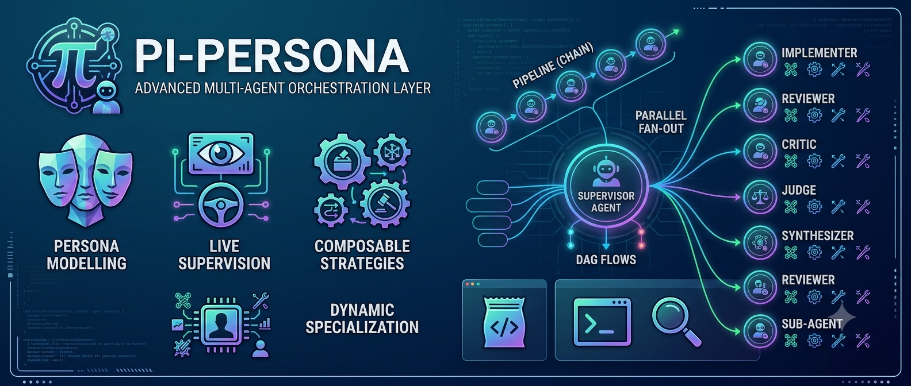

<p align="center">
  
</p>

**Give [Pi](https://github.com/earendil-works/pi) a team you can follow.**
Choose a persona, describe the outcome, and let your supervisor delegate work to specialists.
Watch their progress, send a correction, or bring another Pi session into the conversation.

## Install

Requires **Pi**, **Node.js 22+**, and **Git**. Configure a model provider in Pi first.

Run in your terminal:

```bash
pi install git:github.com/AeonDave/pi-persona
pi
```

Then run these commands **inside Pi** to install the bundled personas and start using one:

```text
/persona seed
/persona dev
```

The defaults are opt-in: `/persona seed` adds missing files and preserves your customizations.

| Install option | Command |
|---|---|
| This project only | `pi install -l git:github.com/AeonDave/pi-persona` |
| Pin this release | `pi install git:github.com/AeonDave/pi-persona@v1.14.2` |
| Update an unpinned install | `pi update git:github.com/AeonDave/pi-persona` |

Restart Pi after updating. For a pinned install, install the new tag explicitly.

## What it does

| Capability | What you get |
|---|---|
| **Switchable personas** | Different ways to approach coding, research, planning, and review |
| **Specialist sub-agents** | Workers with their own roles, skills, and models; independent tasks can run in parallel |
| **Background work** | Results arrive automatically while the supervisor continues other work |
| **Live supervision** | Inspect a worker, send guidance, or stop a run from the agent panel |
| **Councils and flows** | Compare perspectives, run repair-and-check loops, or organize work into stages |
| **Timers and monitors** | Ask for a reminder or a notification when a build, file watcher, or event-producing program reports a change |
| **Exocom** | Connect independent Pi sessions to exchange findings and coordinate work |

## Choose a persona

Start with `dev` for everyday coding. Switch with **F8** or `/persona <name>`.

| Persona | Best for |
|---|---|
| `dev` | Implementing, fixing, and reviewing code |
| `planner` | Turning an idea into a plan before changing code |
| `researcher` | Investigating questions and collecting sourced findings |
| `audit` | Reviewing a change from security, performance, and testing perspectives |
| `verify` | Repairing failures and checking the result with fresh tests |
| `swarm` | Applying the same operation across many independent items |
| `magi` | Comparing three perspectives through a vote, with dissent preserved |
| `judge` | Having an independent reviewer choose between competing proposals |
| `elite` | Scoped security assessment and evidence review |

These are editable starting points. Browse the bundled [personas](personas) and [worker agents](agents),
or read the [practical guide](docs/EXPERIENCE.md) for help choosing a workflow.

## Work with your team

Once seeded, you can start directly with `pi --persona dev`. Describe the work in plain language:

> Fix the cancellation bug. Delegate independent investigations, preserve the public API,
> implement the fix, and run the relevant checks.

Interactive delegation runs in the background by default. The supervisor gathers results and keeps
you informed; you can inspect or redirect a worker at any point.

| Key or command | Action |
|---|---|
| **F8** | Cycle through installed personas |
| **F9** or `/agents` | Open the live agent panel |
| **Enter** / **s** / **x** in the panel | Open output / send guidance / request a stop |
| `/peek` | Show a compact progress summary |
| `/persona list` | List installed personas |
| `/persona off` | Turn off the active persona |
| `/models <query>` | Find an available model |
| `/doctor` | Check configuration and available capabilities |

Each session has a personal name, separate from its persona. Naming is prompted on the first task
or incoming Exocom message; the name survives persona switches and session resume. The supervisor
can assign worker names before launch.

For time-based work, ask “remind me in ten minutes.” For an event, ask “let me know when this build
finishes.” **Keep the Pi session open** for timers and monitors; watches are not restored after a
restart. See [timers and monitors](docs/MONITORS.md) for examples.

## Collaborate with another Pi

| | Use it for |
|---|---|
| **Intercom** | The supervisor communicating with its own sub-agents |
| **Exocom** | Independent Pi sessions sharing findings and coordinating work |

To enable Exocom, open two terminals in the same workspace and start each with:

```bash
pi --exocom --persona dev
```

Then ask one session to consult the other or agree who handles which files.
Use `/exocom` to inspect the connection and workspace code.

A session in another workspace can join using that exact, case-sensitive code:

```bash
pi --exocom=Ab0T --persona researcher
```

Replace `Ab0T` with the code shown by `/exocom`. Both sessions must run on the same machine and
share a Pi agent directory. A peer joining from another workspace can advise and exchange results;
it cannot claim files in the joined workspace.

See the [collaboration guide](docs/EXPERIENCE.md#work-with-another-pi-through-exocom) for day-to-day use.

## Make it yours

Edit installed personas and agents in `~/.pi/agent/persona/agents/`, or add project-specific
overrides in `.pi/agents/`. Run `/persona reload` after editing. Teams and flows let you reuse a
working setup across tasks.

`/persona seed` preserves existing files. **`/persona restore` replaces bundled defaults**, so use it
only when you intend to discard customizations to those files.

For optional long-term memory, add [pi-persona-mind](https://github.com/AeonDave/pi-persona-mind).

## Documentation

| Guide | What's inside |
|---|---|
| [Everyday use](docs/EXPERIENCE.md) | Choosing a persona, following work, and reading results |
| [Customization reference](docs/REFERENCE.md) | Tool APIs, configuration, and copyable recipes |
| [Strategies](docs/STRATEGIES.md) | Teams, councils, flows, and orchestration options |
| [Timers and monitors](docs/MONITORS.md) | Reminders and programs that wake the supervisor |
| [Architecture](docs/ARCHITECTURE.md) | Runtime behavior, boundaries, and design decisions |
| [Shared prompts](docs/SPINE.md) | The optional behavioral layer shared across personas |
| [Telemetry](docs/TELEMETRY.md) | Integration events for companion extensions |

## Develop

From a checkout:

```bash
npm ci
npm run typecheck
npm test
```

Pi loads the TypeScript extension directly; there is no build step.
See [AGENTS.md](AGENTS.md) for contribution conventions. Licensed under [MIT](LICENSE).
