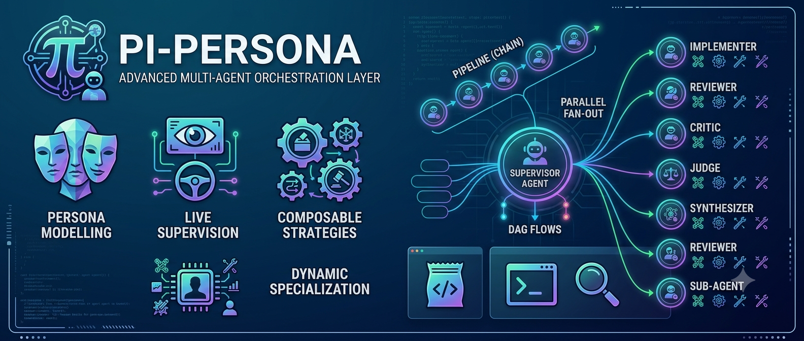
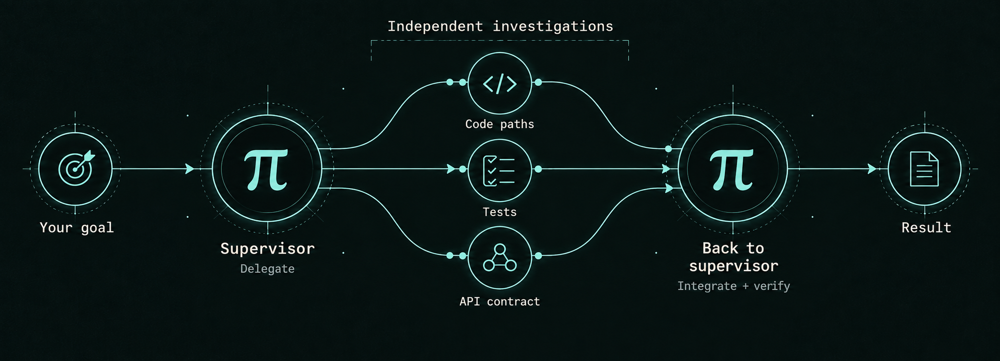
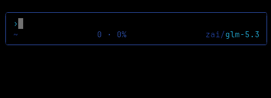

# pi-persona

<p align="center">
  
</p>

**Give Pi a supervised team.**
`pi-persona` brings supervised multi-agent orchestration to [Pi](https://github.com/earendil-works/pi):
async workers, live steering, cross-session collaboration, and switchable personas.
Describe the outcome. A supervisor delegates work, gathers results, and checks the outcome;
you can inspect workers, redirect them, or stop a run while it is in progress.

[Install](#install) · [Team workflow](#work-with-your-team) · [Cross-session collaboration](#collaborate-with-another-pi) · [Personas](#choose-a-persona) · [Documentation](#documentation)

## Install

Requires **Pi ≥ 0.83**, **Node.js 22+**, and **Git**. Configure a model provider in Pi first.

Run in your terminal:

```bash
pi install npm:@aeondave/pi-persona
pi
```

Then run these commands **inside Pi** to install the bundled personas and start using one:

```text
/persona seed
/persona dev
```

Bundled personas are not installed automatically. `/persona seed` adds missing files and preserves
your customizations.

| Install option | Command |
|---|---|
| This project only | `pi install -l npm:@aeondave/pi-persona` |
| Pin this release | `pi install npm:@aeondave/pi-persona@1.15.2` |
| Update an unpinned install | `pi update npm:@aeondave/pi-persona` |
| Git alternative | `pi install git:github.com/AeonDave/pi-persona@v1.15.2` |

Restart Pi after updating. For a pinned install, install the new version or tag explicitly.
If switching from a Git install, remove that source first with
`pi remove git:github.com/AeonDave/pi-persona` (use your exact pinned source if applicable),
then install the npm package. Keep only one source configured to avoid loading the extension twice.

## What it does

| Capability | What you get |
|---|---|
| **Async workers** | Specialists with their own roles, skills, and models; results return while the supervisor continues other work |
| **Live steering** | Inspect a worker, send guidance, or stop a run from the agent panel |
| **Cross-session collaboration** | Exocom connects independent Pi sessions to exchange findings and coordinate work |
| **Councils and flows** | Compare perspectives, run repair-and-check loops, or organize work into stages |
| **Timers and monitors** | Ask for a reminder or a notification when a build, file watcher, or event-producing program reports a change |
| **Switchable personas** | Choose how the supervisor approaches and orchestrates the work |

## Work with your team

Once seeded, you can start directly with `pi --persona dev`. Describe the work in plain language:

> Fix the cancellation bug. Delegate independent investigations, preserve the public API,
> implement the fix, and run the relevant checks.



For example, specialists can investigate code paths, tests, and the API contract in parallel.
Their findings return to the **same supervisor**, which integrates them, verifies the fix, and reports
the outcome. This is one possible workflow, not a fixed pipeline; dependent steps run in order.

Interactive delegation runs in the background by default. The supervisor gathers results and keeps
you informed; you can inspect or redirect a worker at any point.

| Key or command | Action |
|---|---|
| **F8** | Cycle through installed personas |
| **F9** or `/agents` | Open the live agent panel |
| **Enter** / **s** / **x** in the panel | Open output / send guidance / request a stop |
| `/peek` | Show a compact progress summary |
| `/persona list` | List installed personas |
| `/persona off` | Turn off the active persona |
| `/models <query>` | Find an available model |
| `/doctor` | Check configuration and available capabilities |

For time-based work, ask “remind me in ten minutes.” For an event, ask “let me know when this build
finishes.” Keep Pi open while timers and monitors are running; they are not restored after a restart.
See [timers and monitors](docs/MONITORS.md) for examples.

## Collaborate with another Pi

Use Intercom to message workers managed by the current supervisor. Use Exocom to share findings or
coordinate work between independent Pi sessions.

To enable Exocom, open two terminals in the same workspace and start each with:

```bash
pi --exocom --persona dev
```

Then ask one session to consult the other or agree who handles which files.
Use `/exocom` to inspect the connection and workspace code.

A session in another workspace can join using that exact, case-sensitive code:

```bash
pi --exocom=Ab0T --persona researcher
```

Replace `Ab0T` with the code shown by `/exocom`. Both sessions must run on the same machine and
share a Pi agent directory. A peer joining from another workspace can advise and exchange results;
it cannot claim files in the joined workspace.

See the [collaboration guide](docs/EXPERIENCE.md#work-with-another-pi-through-exocom) for day-to-day use.

## Choose a persona

Personas configure the supervisor's approach and orchestration defaults. Start with `dev` for
everyday coding, or choose one for the work ahead.



| Persona | Best for |
|---|---|
| `dev` | Implementing, fixing, and reviewing code |
| `planner` | Turning an idea into a plan before changing code |
| `researcher` | Investigating questions and collecting sourced findings |
| `audit` | Reviewing a change from security, performance, and testing perspectives |
| `verify` | Repairing failures and checking the result with fresh tests |
| `swarm` | Applying the same operation across many independent items |
| `magi` | Comparing three perspectives through a vote, with dissent preserved |
| `judge` | Having an independent reviewer choose between competing proposals |
| `elite` | Scoped security assessment and evidence review |

These are editable starting points. Browse the bundled [personas](personas) and [worker agents](agents),
or read the [practical guide](docs/EXPERIENCE.md) for help choosing a workflow.

## Make it yours

Edit installed personas and agents in `~/.pi/agent/persona/agents/`, or add project-specific
overrides in `.pi/agents/`. Run `/persona reload` after editing.

`/persona seed` preserves existing files. **`/persona restore` replaces bundled defaults**, so use it
only when you intend to discard customizations to those files.

For optional long-term memory, add [pi-persona-mind](https://github.com/AeonDave/pi-persona-mind).

## Documentation

| Guide | What's inside |
|---|---|
| [Everyday use](docs/EXPERIENCE.md) | Choosing a persona, following work, and reading results |
| [Customization reference](docs/REFERENCE.md) | Tool APIs, configuration, and copyable recipes |
| [Strategies](docs/STRATEGIES.md) | Teams, councils, flows, and orchestration options |
| [Timers and monitors](docs/MONITORS.md) | Reminders and programs that wake the supervisor |
| [Architecture](docs/ARCHITECTURE.md) | Runtime behavior, boundaries, and design decisions |
| [Shared prompts](docs/SPINE.md) | The optional behavioral layer shared across personas |
| [Telemetry](docs/TELEMETRY.md) | Integration events for companion extensions |
| [Changelog](CHANGELOG.md) | Notable changes, release by release |

## Develop

From a checkout:

```bash
npm ci
npm run typecheck
npm test
```

Pi loads the TypeScript extension directly; there is no build step.
See [AGENTS.md](AGENTS.md) for contribution conventions. Licensed under [MIT](LICENSE).
